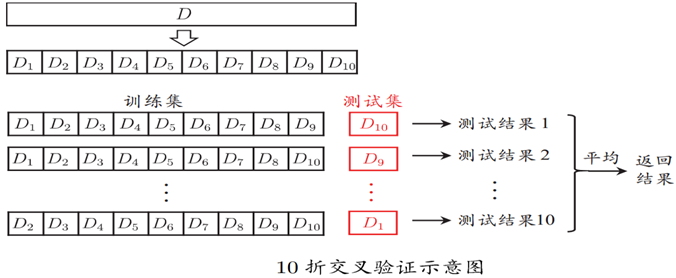

# 人工智能

> 大三下人工智能课复习笔记

## 1 绪论

1956年提出人工智能。

### 基本定义

人工智能：用人工的方法在机器上实现智能。

图灵测试：1950年图灵发表的《计算机与智能》中设计了一个测试，用以说明人工智能的概念。

### 历史

1956年夏，达特茅斯大学 会议 麦卡锡提出“人工智能” 学科正式诞生 人工智能之父。

1977年，费根鲍姆提出“知识工程”。

### 中国在人工智能领域有哪些独特优势

1. 中国人适合做人工智能
2. 可以快速训练大批“人工智能工程师军队”
3. 传统企业“非人工智能”技术弱，容易被AI击溃
4. 互联网大市场孕育的应用到C轮需要人工智能
5. 中国对人工智能约束较少

### 人工智能研究的基本内容

#### 知识表示

将人类知识形式化或者模型化。

表示方法：

1. 符号表示法：

   一阶谓词表示法

   产生式

2. 神经网络等等

#### 机器感知

使机器具有类似人的感知能力，以计算机视觉和计算机听觉为主。

#### 机器思维

通过感知得来的外部信息及机器内部的各种工作信息进行有目的的处理

#### 机器学习

使计算机具有类似人的学习能力，使它能够通过学习自动的获取知识

#### 机器行为

计算机的表达能力

## 2 知识的表示与推理

输入数据->知识表示->知识推理->结论

### 知识的概念

在长期的生活及社会实践中、在科学研究及实验中积累起来的对客观世界的认识与经验；是把有关信息关联在一起所形成的信息结构；反映了客观世界中事物之间的 关系，不同事物或者相同事物间的不同关系形成了不同的知识。

知识表示：将人类知识形式化或者模型化。

## 9 模型评估与选择

### 概念

#### 错误率&误差

错误率是指错分样本的占比E=a/m

误差：样本真实输出与预测输出之间的差异

> 由于事先并不知道新样本的特征，我们只能努力使经验误差最小化；
>
> 很多时候虽然能在训练集上做到分类错误率为零，但多数情况下这样的学习器并不好

#### 过拟合

学习器把训练样本学习的“太好”，将训练样本本身的特点当做所有样本的一般特质，导致泛华性能下降。【优化目标加正则项/early stop】

#### 欠拟合

对训练样本的一般性质尚未学好。【决策树：拓展分支，神经网络：增加训练轮数】

### 评估方法

现实任务中往往会对学习器的泛化性能、时间开销、存储开销、可解释性等方面的因素进行评估并做出选择。

> 我们假设测试集是从样本真实分布中独立采样获得，将测试集上的“测试误差”作为泛化误差的近似，所以测试集要和训练集中的样本尽量互斥。

#### 留出法

直接将数据集划分为两个互斥集合

训练/测试集划分要尽可能保持数据分布的一致性

一般若干次随机划分、重复实验取平均值

训练/测试样本比例通常为2:1~4:1

#### 交叉验证法

将数据集分层采样划分为k个大小相似的互斥子集，每次用k-1个子集的并集作为训练集，余下的子集作为测试集，最终返回k个测试结果的均值，k最常用的取值是10

> 留一法：有多少样本就划分多少子集
>
> 不受随机样本划分方式的影响
>
> 结果比较准确
>
> 数据集大的情况下计算开销大

#### 自助法

有放回采样得到训练集，剩下的作为测试集。

### 性能度量

性能度量是衡量模型泛化能力的评价标准，反映了任务需求；使用不同的性能度量往往会导致不同的评判结果。

> 对于分类任务,错误率和精度是最常用的两种性能度量：
>
> 错误率：分错样本占样本总数的比例
>
> 精度：分对样本占样本总数的比率

## 10 线性模型

### 基本形式

线性模型的目标：学得一个通过属性的线性组合来进行预测的函数。

### 优点

* 形式简单、易于建模
* 可解释性
* 非线性模型的基础

### 线性回归

线性回归(Linear regression)的目的：学得一个线性模型以尽可能准确的预测实值输出标记。

离散属性处理：

* 有序关系：连续化为连续值
* 无序关系：有k个属性值，则转化为k维向量

## 11-12 神经网络

### 神经元模型

### 感知机与多层网络

#### 多层前馈神经网络

定义：每层神经元与下一层神经元全互联, 神经元之间不存在同层连接也不存在跨层连接。

前馈：输入层接受外界输入, 隐含层与输出层神经元对信号进行加工, 最终结果由输出层神经元输出。

学习：根据训练数据来调整神经元之间的“连接权”以及每个功能神经元的“阈值”。

多层网络：包含隐层的网络。

### 误差逆传播算法

误差逆传播算法（Error BackPropagation, 简称BP）是最成功的训练多层前馈神经网络的学习算法. 

### 全局最小和局部最小

### 深度学习

典型的深度学习模型就是很深层的神经网络。

## 13 神经网络

* 前馈型
* 反馈型(Hopfield神经网络)

### 神经网络的工作方式

同步（并行）方式：任一时刻神经网络中所有神经元同时调整状态。

异步（串行）方式：任一时刻只有一个神经元调整状态，而其它神经元的状态保持不变。

> 神经网络方法是一种知识表示方法和推理方法。
>
> 神经网络知识表示是一种隐式的表示方法。
>
> 1944年：Hebb学习规则：当某一突触两端的神经元同时处于兴奋状态，那么该连接的权值应该增强。

### BP网络的优缺点

优点：

* 很好的逼近特征
* 具有较强的泛华能力
* 具有较好的容错性

缺点：

* 收敛速度慢
* 局部极值
* 难以确定隐层和隐层节点的数目

### 生成对抗网络

GAN极大地提高图像生成质量，进一步推动了计算机视觉领域的发展。

> GAN在训练中容易出现一些问题，训练过程具有强烈的不稳定性，实验结果随机，具体表现：
> 训练过程难以收敛，经常出现震荡；
> 训练收敛，但是出现模式崩溃(model collapse)。
> 训练收敛，但是GAN还会生成一些没有意义或者现实中不可能出现的图片。

#### 应用

* 图像修复
* 图像风格迁移
* 图像翻译
* 艺术创作
* 从文字描述生成图片
* AI换脸
* 诗歌写作

## 14 知识表示

...

