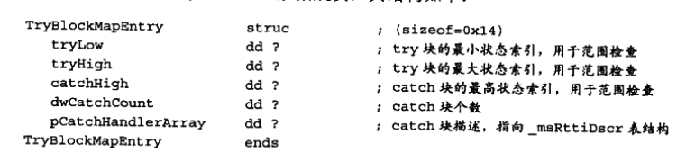

# C++反汇编与逆向分析技术揭秘

## 整本书的内容概括

第一部分讲述了C语言逆向的准备工作。

第二部分讲述了C语言到汇编语言的对应关系。

第三部分讲述了逆向分析技术的应用，将理论与实际相结合。

<u>阅读这本书需要一边实践一边阅读。</u>

## 第一部分 准备工作

使用的调试工具是VC6和od。

主要讲述了一些逆向工具的基本操作。

### 反汇编引擎的工作原理

反汇编是逆向工程中的一个重点。

指令前缀：

1. 重复
2. 跨段
3. 操作数、地址，位数转换

Opcode 指令操作码

Mode R/M 操作数类型

SIB 辅助Mode R/M 计算地址偏移

Displacement: 同样也是计算地址偏移

具体如下：

反汇编引擎就是解析机器码然后给用户呈现对应的汇编代码。

## 第二部分 C++反汇编揭秘

### 基本的浮点数指令(通常被忽略掉的部分)

浮点数的操作是通过浮点数指令来实现的，而普通数据类型使用的是通用寄存器。

有ST(0)~ST(7)共8个栈空间组成，使用时优先使用ST(0)。

### 字符编码

在VC中char定义ASCII，wchar_t定义Unicode。

### 程序真正的入口

真正的入口一般来说不是main活着WinMain，而知mainCRTStartup/wmainCRTStartup(控制台)，或WinMainCRTStartup/wWinMainCRTStartup(GUI)，具体实现视编译选项而定。

mainCRTStartup由KERNEL32.dll负责调用，在mainCRTStartup中再调用main函数。

主要来说完成了命令行的转化、堆的初始化、全局对象和浮点寄存器的初始化。

### 编译优化

常量传播：没有变化的变量当做常量进行编译。

常量折叠：能计算出的表达式转化为常量进行编译。

(然后是关于除法的一大堆讲解)

### 从内存的角度看继承和多重继承

父类的成员数据和成员函数均会存在于子类的内存空间。

这部分较为复杂，主要是虚表和继承的关系。

### 异常处理

1. 注册异常回调函数
2. 抛出异常，执行异常回调函数

在调用__CxxFrameHandler前通过eax传入了一个结构体如下(大小20bytes)：

UnWindMapEntry结构体如下：

因为异常可能多次展开，所以使用toState项用于判断结构是否在数组中。

lpFunction指向执行的函数的地址。

TryBlockMapEntry结构体如下：

总结的关系图：

## 第三部分 逆向分析技术应用

### PEID

通过特征码判定VC6编译的程序，通过修改程序特征码来忽悠PEID。

### 熊猫烧香病毒分析

### od分析

